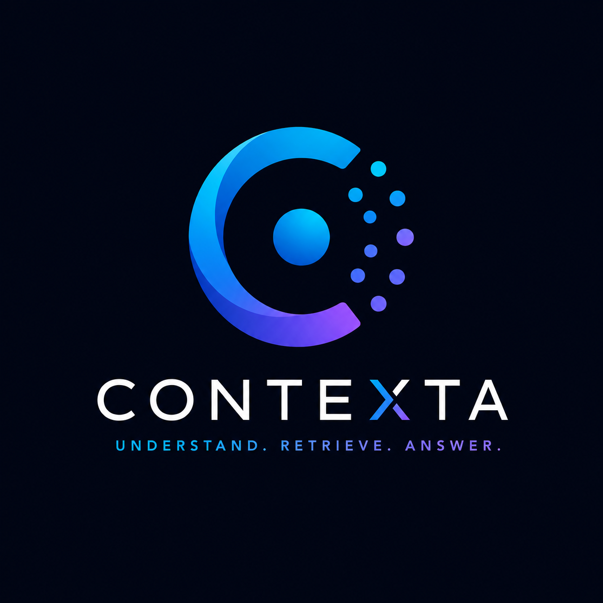

<p align="center">
  
</p>

<p align="center">
  
  
  
  
</p>

# Contexta — A RAG-Powered Document Q&A Assistant

**Understand. Retrieve. Answer.**

Contexta is a Retrieval-Augmented Generation (RAG) chat application built with LangChain, Chroma, and Chainlit. Upload a document (PDF, DOCX, TXT, or CSV) and ask questions about it — or just chat normally, and Contexta will answer from general knowledge instead. Every answer is clearly labeled with its source.

## 🚀 Live Demo

**Try Contexta here:** https://contexta.tarakbandhara.in/

> The application is deployed and available for interactive use.

This was built as a hands-on learning project to understand RAG fundamentals — not by following a fixed tutorial, but by building, testing against real documents, finding real failures, and fixing them with evidence rather than guesswork.

## Features

- 📎 **Optional document upload** — attach a PDF, Word doc, text file, or CSV to any message
- 🧠 **Smart routing** — automatically answers from your document when relevant, or from general knowledge when it isn't, and tells you which
- 📊 **Adaptive chunking** — automatically analyzes each document's structure (prose vs. resumes/forms) and picks appropriate chunk sizes, instead of using one fixed value for every document
- 🎯 **Calibrated relevance filtering** — a three-tier scoring system (rather than a single fixed threshold) that adapts to different documents and embedding score distributions
- 📝 **Whole-document summaries** — vague questions like "what is this about?" are detected and answered using a representative sample across the entire document
- ⚡ **Streaming responses** with live token-by-token display
- 🔄 **Session-based conversation history** — follow-up questions understand context from earlier in the conversation
- 🔒 **Isolated per-session storage** — each user gets their own private vector collection, cleaned up automatically when their session ends, so concurrent users' documents never mix

## Architecture

```
User uploads file / asks question
         │
         ▼
   ingestion.py  ── loads file, analyzes structure, chunks adaptively
         │
         ▼
  vectorstore.py ── embeds chunks (HuggingFace), stores in Chroma
         │
         ▼
  rag_chain.py   ── retrieves candidates, applies 3-tier relevance
         │           filter, decides: document-grounded / summary /
         │           general-knowledge, builds the prompt
         ▼
    llm.py       ── sends the prompt to the LLM (OpenRouter), streams
         │           the response back
         ▼
    app.py       ── Chainlit UI: file upload, chat, streaming display,
                     source citations
```

## The debugging journey (the interesting part)

A few genuine problems this project ran into, and how they were actually diagnosed and fixed:

**Fixed chunk sizes don't generalize.** A chunk size that worked well for one PDF produced poor retrieval on a resume — because resumes barely use sentence-ending punctuation, and the initial chunking heuristic relied on it. The fix: analyze each document's actual sentence-vs-line structure and fall back to line-based measurement when sentence detection clearly fails (fewer than ~20 detected sentences).

**A single relevance threshold broke on real data.** A fixed cutoff correctly rejected obviously irrelevant questions, but also *incorrectly* rejected a perfectly good, specific-fact answer on a denser document — because different documents produce different score distributions. The fix: a three-tier check (absolute ceiling for "nothing is relevant," an absolute "trust it" bar, and a relative "does this stand out from the rest" comparison) calibrated against real test data across multiple documents.

**"It's broken for some file types" turned out to be a transient API overload.** What looked like a DOCX/TXT-specific bug was actually the LLM provider returning a temporary `503` at that exact moment — confirmed by testing the same file type again minutes later with no issue.

**A routing bug that silently mislabeled sources.** A broad-sample fallback (built for vague "what is this document about?" questions) was firing for *any* failed retrieval, including genuinely unrelated questions — meaning the source badge would show the uploaded document's filename even when the actual answer came from general knowledge. Fixed by having an LLM classification step confirm the question is actually document-related before triggering that fallback path.

**Attaching a file and asking a question in the same message silently dropped the question.** The upload flow correctly ingested the document and confirmed it — but then just stopped, discarding whatever the user had typed alongside it. Fixed by restructuring the flow to fall through into the normal answering logic whenever there's also text in the same message, instead of always returning immediately after confirming the upload.

**Preparing for deployment surfaced a real multi-user data collision risk.** The vector store used one shared, hardcoded collection name for every session — meaning if two people used the app at the same time, one person's uploaded document could silently overwrite another's. Fixed by generating a unique collection name per session (so concurrent users are fully isolated) and cleaning up each session's collection automatically when the chat ends.

## Tech Stack

- **Orchestration:** LangChain
- **Vector store:** Chroma
- **Embeddings:** HuggingFace (`sentence-transformers/all-MiniLM-L6-v2`)
- **LLM:** OpenRouter (`qwen/qwen3.8-27b:free`)
- **UI:** Chainlit

## Setup

```bash
pip install -r requirements.txt
```

Create a `.env` file with:
```
OPENROUTER_API_KEY=your_key_here
HUGGING_FACE_API_KEY=your_key_here
open_router_base_url=https://openrouter.ai/api/v1
```

Run it:
```bash
chainlit run app.py
```

## Known Limitations

- **Mainly designed for single-document use.** Contexta works best with one document at a time. Uploading multiple documents in the same session may or may not retrieve evenly between them — for example, a large PDF uploaded alongside a small Word doc will tend to dominate retrieval, while two similarly-sized documents tend to work fine together.
- **No reranking model.** Retrieval relies on embedding similarity plus threshold calibration, not a dedicated reranker.
- **No query rewriting.** Follow-up questions that rely heavily on unstated context from earlier turns (e.g., "give me the first 9 lines of that page") may not retrieve well, since retrieval doesn't use conversation history — only answer generation does.
- **Excel (.xlsx) is not supported** — attempted, but the available parsing library introduced heavy dependencies and produced poor chunk structure for tabular data; dropped in favor of keeping the project focused and reliable.

## License

MIT — free to use, learn from, and build on.
